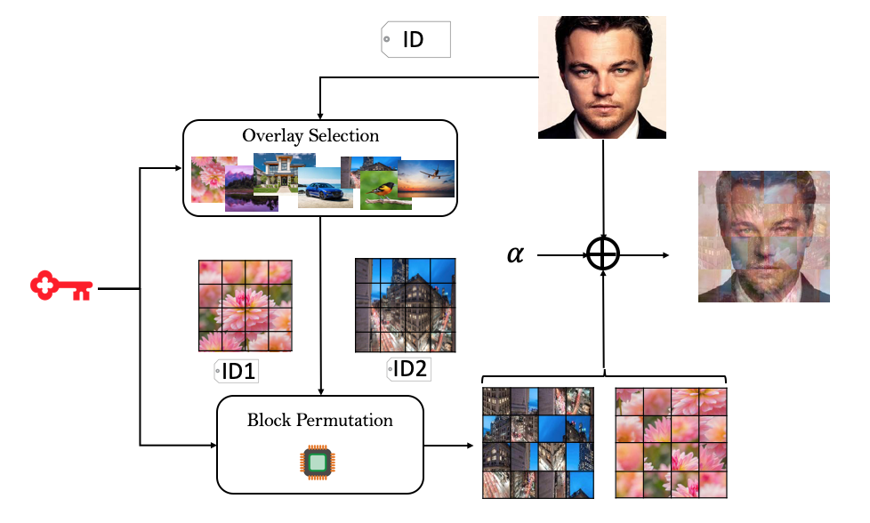

## On the (Im)Practicality of Adversarial Perturbation for Image Privacy (K-RTIO and UEP)

 

## Install Environment and Libraries:

python3 -m venv myenv

source myenv/bin/activate

pip3 install pycryptodome

pip3 install opencv-python

pip3 install pillow

pip3 install matplotlib

pip3 install sewar

### To perturb with KRTIO 
python3 KRTIO_UEP.py --input './inputfolder' --mode 'Enc' --k 3 --bl_size 16 

### To Remove KRTIO Perturbation
python3 KRTIO_UEP.py --input './inputfolder' --mode 'Dec' --k 3 --bl_size 16 

### To perturb with UEP
python3 KRTIO_UEP.py --input  './inputfolder' --mode 'Enc' --method 'UEP'

### To Remove  UEP Perturbation
python3 KRTIO_UEP.py --input './inputfolder'   --method 'UEP' --mode 'Dec' 

Please cite: A. Rajabi, R. Bobba, M. Rosulek, C. Wright, W. Feng, " On the (Im)Practicality of Adversarial Perturbation for Image Privacy " Accepted in Privacy Enhancing Technology Symposium , 2021.

