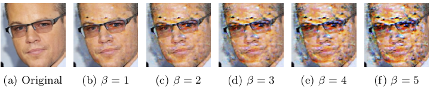

## On the (Im)Practicality of Adversarial Perturbation for Image Privacy (K-RTIO and UEP)

Image hosting platforms are a popular way to store and share images with family members and friends. However, such platforms typically have full access to images raising privacy concerns. These concerns are further exacerbated with the advent of Convolutional Neural Networks (CNNs) that can be trained on available images to automatically detect and recognize faces with high accuracy.

Recently, adversarial perturbations have been proposed as a potential defense against automated recognition and classification of images by CNNs. In this paper, we explore the practicality of adversarial perturbation- based approaches as a privacy defense against automated face recognition. Specifically, we first identify practical requirements for such approaches and then propose two practical adversarial perturbation approaches – 

(i) learned universal ensemble perturbations (UEP)

 
 

 
(ii) k-randomized transparent image overlays (k-RTIO) that are semantic adversarial perturbations. 

 

We demonstrated how users can generate effective transferable perturbations under realistic assumptions with less effort.

## Install Environment and Libraries:

python3 -m venv myenv

source myenv/bin/activate

pip3 install pycryptodome

pip3 install opencv-python

pip3 install pillow

pip3 install matplotlib

pip3 install sewar

### To perturb with KRTIO 
python3 KRTIO_UEP.py --input './inputfolder' --mode 'Enc' --k 3 --bl_size 16 

### To Remove KRTIO Perturbation
python3 KRTIO_UEP.py --input './inputfolder' --mode 'Dec' --k 3 --bl_size 16 

### To perturb with UEP
python3 KRTIO_UEP.py --input  './inputfolder' --mode 'Enc' --method 'UEP'

### To Remove  UEP Perturbation
python3 KRTIO_UEP.py --input './inputfolder'   --method 'UEP' --mode 'Dec' 

Please cite: A. Rajabi, R. Bobba, M. Rosulek, C. Wright, W. Feng, " On the (Im)Practicality of Adversarial Perturbation for Image Privacy " Accepted in Privacy Enhancing Technology Symposium , 2021.

